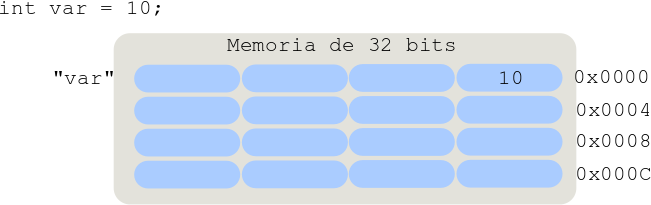

# Punteros en C++

Los punteros (o apuntadores) son variables que se utilizan para almacenar direcciones de memoria, puntualmente las direcciones de memoria que fueron asignadas a variables convencionales en las que se almacenan datos de distinto tipo. Vale la pena entonces recordar que a todas las variables en C++ se les asigna un espacio de memoria en el cual se va almacenar el valor que se le asigne en algún punto de la aplicación a esa variable, el tamaño de dicho espacio va depender del tipo de dato que se pretende almacenar en la variable, del compilador y de la arquitectura del procesador. Cada uno de los espacios de memoria cuenta con una dirección para identificarlo, esta dirección es por lo general un número en representación hexadecimal. Es precisamente ese número correspondiente a la dirección lo que se almacena en un puntero. 

Observe la siguiente imagen de ejemplo, se declara una variable `var` y se inicializa directamente en la declaración, dicha variable recibe un espacio en memoria para almacenar el valor que se le asigna en la inicialización. Dicho espacio en memoria tiene su propia dirección para poder ser referenciado.



Se puede declarar un puntero para almacenar la dirección de memoria correspondiente a la variable `var`, es decir, se puede "apuntar" un puntero a la variable `var`. Para declarar un puntero se utiliza la sintaxis para declaración de variables: calificadores opcionales, modificadores opcionales, tipo de dato obligatorio y un identifador para el puntero que también es obligatorio. El tipo de dato del puntero debe ser obligatoriamente el mismo tipo de dato de la variable a la que se pretende apuntar, es decir, si se requiere almacenar la dirección en memoria de una variable de tipo `int`, entonces el tipo de dato del puntero también debe ser `int`. Un puntero se distingue de otras variables porque en su declaración se utiliza el operador `*` luego del tipo de dato y antes del identificador del puntero. Observe a continuación la declaración de varios punteros:

```cpp
int *puntero_a_int;
float *puntero_a_float;
ClaseA *puntero_a_objeto_claseA;
```
Para apuntar un puntero a una variable se utilizan el operador de asignación `=`, el operador `&` y la variable a la que se quiere apuntar. Con el operador `&` se obtiene la dirección de la variable y se le asigna al puntero mediante el operador de asignación `=`. Observe, ejecute y analice el ejemplo a continuación:

```C++ runnable
#include<iostream>
using namespace std;

class MiClase
{
    int x;
    public:
    MiClase():x(0){}
};

int main()
{
    int var = 250;  //Una variable cualquiera
    int *ptr_var = &var;  //Apuntando un puntero a la variable var
    
    MiClase obj;  //Un objeto cualquiera
    MiClase *ptr_obj = &obj;  //Apuntando un puntero al objeto obj
    
    cout<<"Valor de la variable var: "<<var<<endl;
    cout<<"Direccion de la variable var: "<<&var<<endl;
    cout<<"Direccion almacenada en el puntero ptr_var: "<<ptr_var<<endl;
    cout<<"-------------------------------------------------------"<<endl;
    cout<<"Direccion del objeto obj: "<<&obj<<endl;
    cout<<"Direccion almacenada en el puntero ptr_obj: "<<ptr_obj<<endl;
    return 0;
}
```
Se puede acceder (leer/modificar) mediante el puntero al valor que está almacenado en la dirección de memoria (la que está almacenada en el puntero por supuesto) utilizando el operador `*`. Pruebe el ejemplo a continuación:

```C++ runnable
#include<iostream>
using namespace std;

int main()
{
    float var = 33.66;  //Una variable cualquiera
    float *ptr_var = &var;  //Apuntando un puntero a la variable var
    
    cout<<"Valor de la variable var: "<<var<<endl;
    cout<<"Direccion de la variable var: "<<&var<<endl;
    cout<<"Valor de lo que hay almacenado en la direccion de memoria "<<ptr_var<<" : "<<*ptr_var<<endl;
    
    // Modificando el valor a través del puntero:
    *ptr_var = 100.25;
    cout<<"Valor de la variable var: "<<var<<endl;
    
    return 0;
}
```
# Acceso a miembros de clase mediante puntero

Para acceder a los miembros de clase de un objeto a través de un puntero se utiliza el operador flecha `->` en lugar del operador punto `.`, obviamente el acceso con operador flecha sigue respetando los niveles de acceso establecidos en la definición de la clase. El siguiente ejemplo ilustra el uso del operador flecha:

```C++ runnable
#include<iostream>
using namespace std;

class MiClase
{
    int x;
    public:
    MiClase(int n):x(n){}
    void printX(){cout<<"El valor de x es: "<<x<<endl;}
    void setX(int a){x = a;}
};

int main()
{
    MiClase obj(15);  //Un objeto cualquiera
    MiClase *ptr_obj = &obj;  //Apuntando un puntero al objeto obj
    
    obj.printX(); //Acceso a un miembro a través del objeto
    ptr_obj->printX();  //Accesso a un miembro a través del puntero
    ptr_obj->setX(66); //Accesso a un miembro a través del puntero
    obj.printX(); //Acceso a un miembro a través del objeto
    return 0;
}
```
# Aritmética de punteros

Los punteros almacenan un valor que corresponde a una dirección de memoria y el lenguaje de programación C++ permite que un puntero pueda recibir una nueva dirección de memoria, es decir que sea apuntado a otra variable. Es claro que esto último solo se prodra lograr si la nueva posición de memoria almacena un dato del mismo tipo del puntero o sí se hace una conversión explícita del tipo de dato del puntero. Para poder desplazar un puntero por la memoria C++ permite ejecutar los operadores de adición y sustracción en los punteros, por tanto la dirección que almacena el puntero se puede incrementar o decrementar de acuerdo a la operación que se involucre al puntero. Está permitido el uso de los siguientes operadores: `+`, `-`, `++` y `--` para ejecutar operaciones de aritmética de punteros. Observe el siguiente ejemplo que ilustra el concepto. Puede observar la diferencia entre las direcciones de memoria cada vez que se hace un aumento en la dirección del puntero:

```C++ runnable
#include<iostream>
using namespace std;

int main()
{
    int array[3] = {15, 35, 55};
    int *ptr = array;  // No se usa el operador '&' porque los arreglos se comportan como punteros 
    
    cout<<"Direccion almacenada por ptr: "<<ptr<<endl;
    cout<<"Valor en la direccion almacenada por ptr: "<<*ptr<<endl;
    cout<<"Direccion almacenada por ptr + 1: "<<ptr+1<<endl;
    cout<<"Valor en la direccion almacenada por ptr + 1: "<<*(ptr+1)<<endl;
    cout<<"Direccion almacenada por ptr + 2: "<<ptr+2<<endl;
    cout<<"Valor en la direccion almacenada por ptr + 2: "<<*(ptr+2)<<endl;
    
    return 0;
}

```
Ejecute y analice el ejemplo a continuación. ¿Puede explicar los incrementos que se hacen al puntero? ¿Por qué se incrementa el puntero en esas cantidades aún sabiendo que los miembros de la estructura están en posiciones contiguas de memoria?

```C++ runnable
#include<iostream>
using namespace std;

/* Estructura con miembros de distintos tipos de datos */
struct Clase
{
	char mem1 = 'D';
	double mem2 = 12345678987654321.88888888888889;
	unsigned short mem3 = 4554;
	float mem4 = 3.14159;
	long long int mem5 = 5444333222;
	char mem6 = 'X';
	int mem7 = 434776;
	double mem8 = 2.35656778457911;		
};

int main()
{

    struct Clase local_struct; // Estructura local de tipo struct Clase
	
	struct Clase *ptr_str = &local_struct; // Puntero a variables (objetos) del tipo de la estructura struct Clase
	
	/* Acceso a través del puntero ptr_str a los miembros de local_struct,
	   mediante conversion explicita (casting) y aritmetica de punteros */
	   
	/* 1. El puntero ptr_str que es del tipo *struct Clase
	   debe convertirse a un puntero del tipo de dato al que se quiere acceder,
	   por ejemplo: a un dato char, entonces se debe convertir asi (char*)ptr_str */
	   
	/* 2. Con el operador asterisco se debe acceder al valor almacenado en la dirección
	   a la que apunta el puntero ptr_str convertido: *((char*)ptr_str) */
	   
	/* 3. Con aritmetica de punteros se puede desplazar al puntero ptr_str a traves de 
	   las posiciones de memoria donde se almacenan los miembros de la estructura, por
	   ejemplo: *((double*)ptr_str+1) */
	   
	   
	cout<<*((char*)ptr_str)<<endl;  
	cout<<*((double*)ptr_str+1)<<endl;
	cout<<*((short*)ptr_str+8)<<endl;
	cout<<*((float*)ptr_str+5)<<endl;
	cout<<*((long long int*)ptr_str+3)<<endl;
	cout<<*((char*)ptr_str+32)<<endl;
	cout<<*((int*)ptr_str+9)<<endl;
	cout<<*((double*)ptr_str+5)<<endl;
	
	return 0;
}
```
# Puntero `this`

El puntero `this` es un miembro privado puntero que tienen de manera implícita todas las clases en C++. Este puntero almacena la dirección de memoria asignada al objeto del cual es miembro. Para una clase X el puntero `this` es de tipo X* y solo puede ser invocado por miembros no-estáticos de la clase (recuerde que los miembros estáticos no necesitan de una instancia de clase para ser invocados)

Usos principales del puntero `this`:
<ul>
<li>Es una práctica generalizada el uso del puntero `this` para referenciar variables de la clase que tienen el mismo nombre de los parámetros de entrada o de variables locales de los métodos de la clase (Con el fin de resolver ambigüedades). Ejemplo:</li>

```cpp
class MyClass
{
    int x, y;
    public:
    void setX(int x)
    {
        int y = 25;
        this->x = x;
        this->y = y;
    }
};
```
<li>Para retornar una referencia al objeto a través de uno de sus métodos. Esto con el fin de permitir el encadenamiento de llamados a distintos métodos de un mismo objeto</li>

```cpp
class CustomIntStack
{
    int array[20];
    int cuenta = 0;
    public:
    CustomIntStack& operator<<(int elem)
    {
        if(cuenta < 20)
        {
            array[cuenta] = elem;
            cuenta++;
        }
        else
            cout<<"Stack esta lleno!!!"<<endl;
            
        return *this; //En este caso no retorna referencia sino el objeto mismo
    }
    void printInfo()
    {
        if(cuenta > 0)
        {
            for(int i=0; i<cuenta; ++i)
                cout<<array[i]<<endl;
        }
    }
};

int main()
{
    CustomIntStack myStack;
    myStack<<1<<2<<3<<4<<5<<6<<7; //Agregando elementos al stack
    myStack.printInfo();
    
    return 0;
}
```
</ul>
